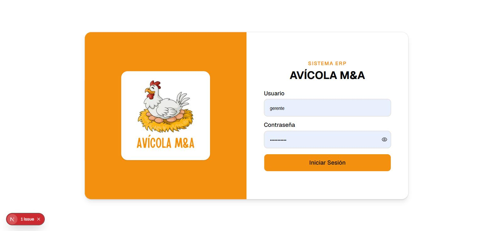
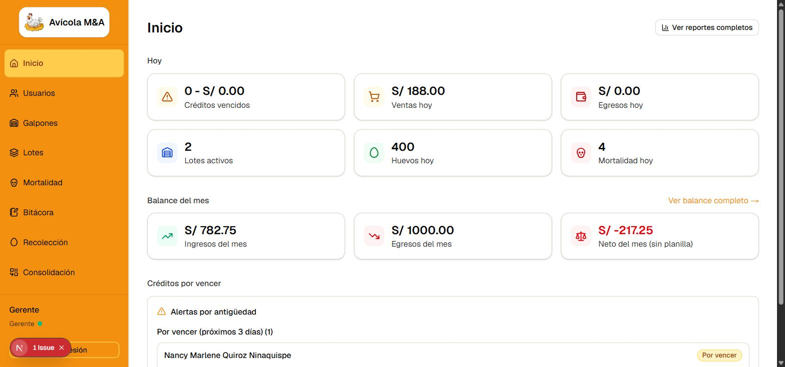
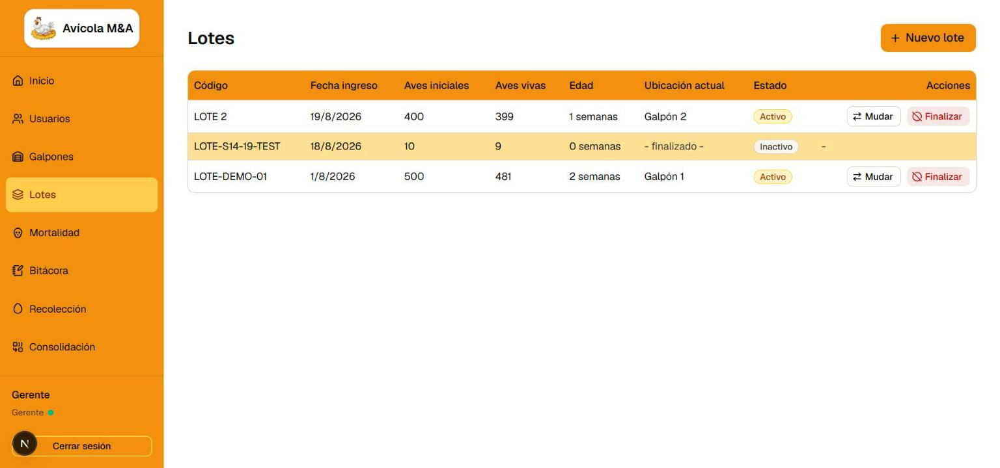
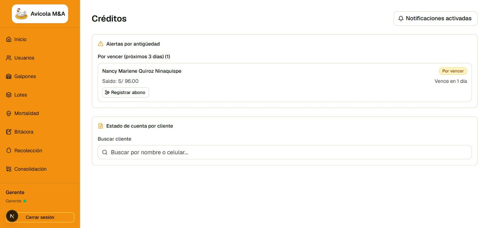
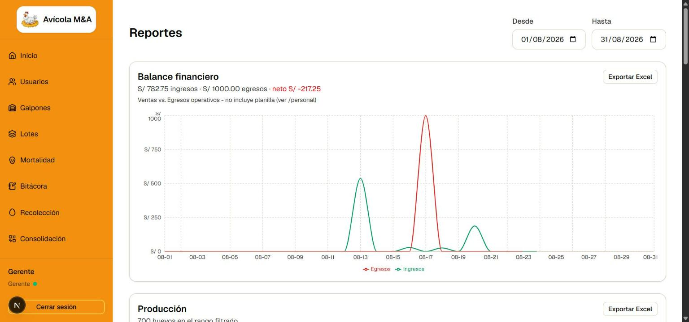
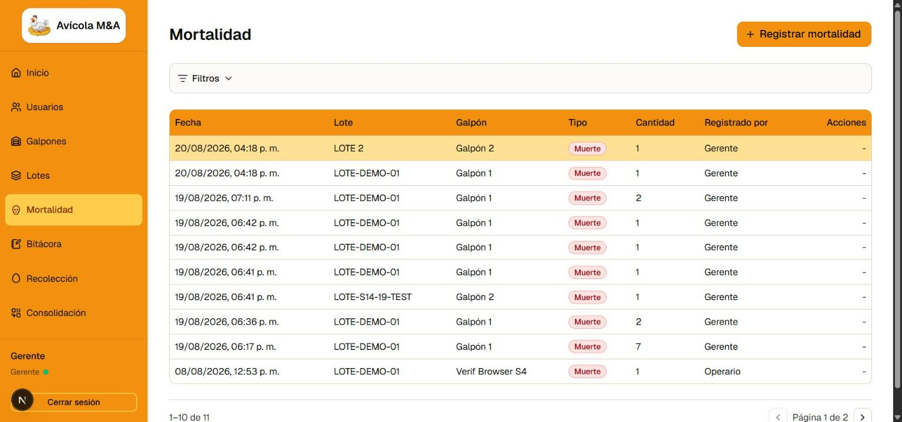
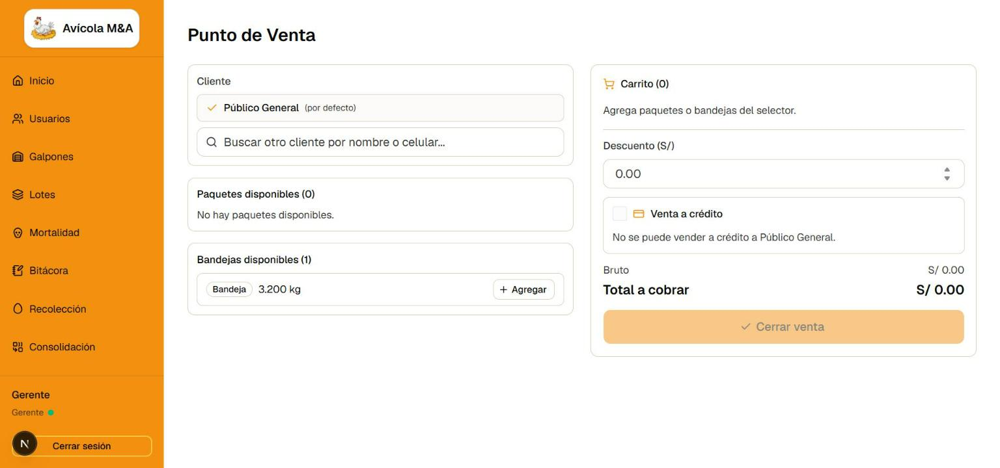

# Manual de Usuario — Avícola M&A

Sistema de gestión interna de la granja: producción de huevos, ventas,
créditos, egresos y personal. Reemplaza el cuaderno físico y las hojas de
cálculo sueltas.

Hay dos roles: **Gerente** (visibilidad total: finanzas, créditos,
reportes, configuración) y **Operario** (rapidez en campo: producción,
mortalidad, ventas — muchas veces sin señal). Cualquier Operario puede
también usar el Punto de Venta; no existe un rol de "Vendedor" aparte.

> Las capturas de este manual son de la app real, tomadas el 2026-08-20.
> Se actualizarán si el diseño cambia de forma notoria.

## Iniciar sesión

Entrá a la URL de la app, escribí tu **Usuario** y **Contraseña**, y tocá
**Iniciar Sesión**. El ícono del ojo, junto al campo de contraseña, la
muestra u oculta mientras escribís.

Si te equivocás de contraseña varias veces seguidas, el sistema bloquea
los intentos por 15 minutos — es una protección de seguridad, no un
error. Esperá y volvé a intentar.

Si tu sesión queda inactiva por un rato largo, se cierra sola por
seguridad — volvé a iniciar sesión con las mismas credenciales.

**¿Olvidaste tu contraseña?** Todavía no hay una pantalla para
cambiarla vos mismo — pedile a un Gerente que te la resetee desde
**Usuarios** (ver más abajo).

---

## Para el Gerente

### Inicio (dashboard)

Lo primero que ves al entrar. De un vistazo:

- **Hoy**: créditos vencidos, ventas de hoy, egresos de hoy, lotes
  activos, huevos recolectados hoy, mortalidad de hoy.
- **Balance del mes**: ingresos, egresos y neto (sin incluir la
  planilla de personal, aclarado explícitamente en la tarjeta).
- **Créditos por vencer**: los mismos que vas a ver en la pantalla
  **Créditos**, con acceso directo a "Registrar abono".
- Un botón **Ver reportes completos** te lleva a la pantalla de
  Reportes.

El Operario ve una versión más simple de esta misma pantalla (solo las
6 tarjetas de "Hoy", sin Balance ni Créditos por vencer).

### Usuarios (solo Gerente)

Alta, edición y desactivación de cuentas de Gerente/Operario. Al
resetear la contraseña de alguien, sus sesiones activas se cierran
automáticamente — es la forma de "sacar" a alguien que tenía acceso con
la contraseña vieja.

No se puede desactivar al último Gerente activo del sistema — siempre
tiene que quedar al menos uno.

### Galpones y Lotes

**Galpones**: la infraestructura física de la granja, con su capacidad
máxima de aves.

**Lotes**: cada grupo de aves que ingresa a la granja. Un lote nuevo
queda alojado de inmediato en el galpón que elijas, con la edad inicial
(en semanas) que tenían las aves al ingresar — no siempre es 0, cubre
el caso de comprar aves ya crecidas.

Desde acá podés:
- **Mudar** un lote a otro galpón (queda registrado el historial
  completo de ubicaciones, nunca se pierde).
- **Finalizar** un lote (venta o retiro total) — la edad mostrada queda
  congelada en ese momento, no sigue subiendo.

La fecha de ingreso de un lote nunca puede ser futura.

### Créditos y notificaciones push

Panel de alertas por antigüedad (créditos por vencer o ya vencidos) y
buscador de estado de cuenta por cliente, con historial completo de
abonos.

**Notificaciones push (nuevo, Sprint 16):** el botón arriba a la
derecha activa avisos automáticos en tu navegador/celular el día que un
crédito se vence — no hace falta que entres a mirar la pantalla todos
los días. Al tocarlo, el navegador te va a pedir permiso una sola vez
("¿Permitir notificaciones?") — aceptalo. El botón cambia a
"Notificaciones activadas" cuando ya está funcionando. Podés
desactivarlas en cualquier momento desde el mismo botón. Es una
funcionalidad exclusiva del Gerente.

Un crédito recibe como máximo **un** aviso — el día exacto que vence,
no todos los días mientras siga vencido.

### Reportes

Ocho reportes con gráfico + exportación a Excel, filtrables por rango
de fechas (Desde/Hasta): producción, mortalidad (general y por
lote/galpón), ventas por método de pago, ranking de clientes, créditos
y cobranza, gasto por categoría, y balance financiero.

El botón **Exportar Excel** de cada reporte descarga exactamente los
datos que estás viendo en pantalla, para el mismo rango de fechas — con
formato de moneda y encabezado de marca, listo para abrir en Excel o
compartir.

### Egresos y Personal

Registro de gastos operativos (alimentos, insumos/vacunas, servicios,
mantenimiento, varios) y planilla informativa de personal (altas,
bajas, movimientos de sueldo). Un egreso o movimiento se puede anular
dentro de una ventana corta después de registrarlo — pasado ese plazo,
queda fijo.

### Precio por Kilo

El precio vigente al que se vende el huevo, con historial completo
(nunca se pisa un precio anterior — cada cambio es una fila nueva).

---

## Para el Operario (y también el Gerente)

### Recolección (producción diaria)

Registrás la cantidad total de huevos recolectados por lote. El sistema
arma automáticamente los paquetes completos (180 unidades cada uno) y
te pide pesar cada paquete en la balanza — el peso se digita a mano,
leído directo de la báscula física, no hay integración por Bluetooth.
Lo que sobra (menos de un paquete completo) queda como "sueltos".

### Mortalidad

Registrás cuántas aves murieron o se descartaron, por lote — el galpón
se resuelve solo, no hace falta elegirlo.

**Ventana de deshacer:** después de guardar, tenés unos minutos para
tocar "Deshacer" si te equivocaste — pasado ese plazo, el registro
queda fijo (revertirlo ya no resta las aves de vuelta).

**Sin señal:** si registrás mortalidad sin conexión a internet (una
zona de la granja sin señal), la app te avisa "Guardado sin conexión" y
lo manda solo apenas recuperás señal — no hace falta que hagas nada más
ni que vuelvas a registrarlo. Podés ver qué quedó pendiente de enviar
en la pantalla **Pendientes** del menú.

### Bitácora

Notas generales de la granja, en texto libre — no se vinculan a un
galpón específico. Se buscan por palabra.

### Consolidación

Herramienta para "romper" un paquete o una bandeja ya armados y
repartir su contenido de vuelta al inventario suelto — para corregir un
error o reorganizar el stock.

### Punto de Venta (POS)

La pantalla donde se cierra una venta.

Pasos:
1. **Cliente**: "Público General" viene preseleccionado para una venta
   de mostrador sin cliente registrado. Si es un cliente real, buscalo
   por nombre o celular (o dalo de alta ahí mismo si no existe todavía).
2. Agregá los paquetes o bandejas disponibles al carrito.
3. Si hace falta, aplicá un **descuento** (nunca puede superar el total
   de la venta).
4. **Venta a crédito** (opcional, no disponible para "Público
   General"): marcá el check, indicá cuánto se cobra al contado ahora
   (puede ser 0, crédito total) y la fecha límite de pago.
5. Elegí el **método de pago** (Efectivo, Yape, Plin, Transferencia) —
   solo aparece si se está cobrando algo ahora mismo.
6. **Cerrar venta.** Se genera un comprobante que podés descargar como
   PDF o compartir directo (por ejemplo, a WhatsApp).

**Clientes:** gestión de clientes registrados, con su tipo (Mayorista,
Minorista, Eventual).

### Trabajar sin conexión

Mortalidad, Bitácora y Recolección funcionan sin señal: la app guarda
tu registro en el propio celular y lo envía solo apenas volvés a tener
conexión, sin que tengas que hacer nada. La pantalla **Pendientes**
(menú lateral) muestra qué quedó en cola, con su estado (Pendiente,
Enviando, Sincronizado, Error) — desde ahí también podés reintentar a
mano si algo quedó con error.

Para que esto funcione bien, instalá la app en la pantalla de inicio de
tu celular (PWA) — el propio navegador te va a ofrecer "Instalar" la
primera vez que entres.

---

## Preguntas frecuentes

**¿Puedo perder datos si se corta la señal a mitad de un registro?**
No — mientras el registro haya llegado a mostrar "Guardado sin
conexión" (o el guardado normal si hay señal), ya está seguro. Se
sincroniza solo.

**¿Por qué no veo la opción de notificaciones push en Créditos?**
Es exclusiva del Gerente.

**¿Puedo anular una venta ya cerrada?**
No, las ventas no se anulan en este sistema. Un crédito sí admite
abonos parciales hasta liquidarse.

**¿Qué pasa si mi contraseña la marcó como expuesta el gestor de
contraseñas del navegador?**
Pedile a un Gerente que te la resetee desde Usuarios — eso cierra
automáticamente cualquier sesión abierta con la contraseña vieja.
